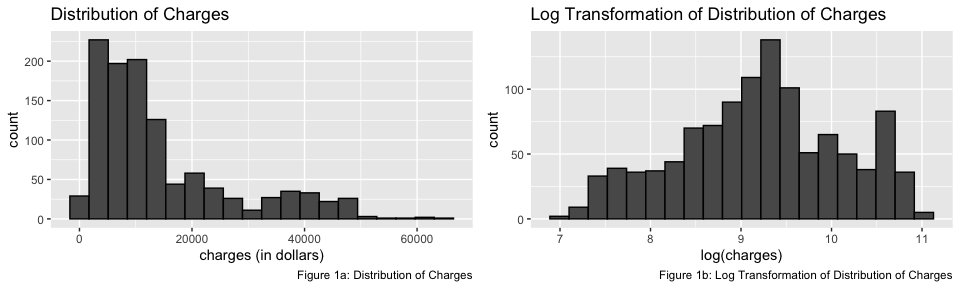
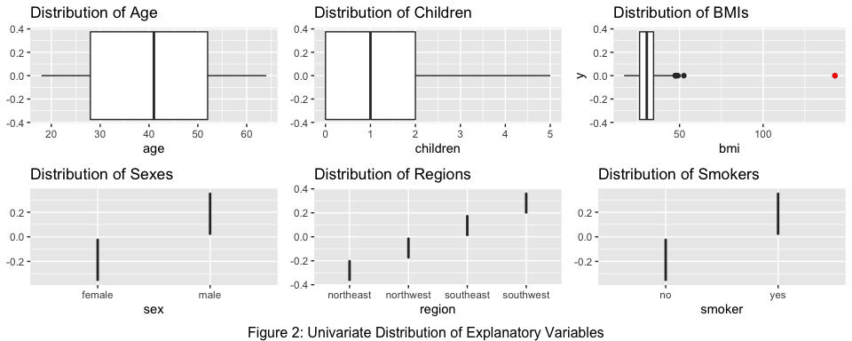
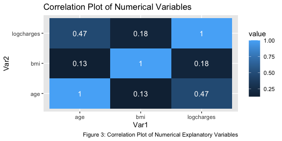
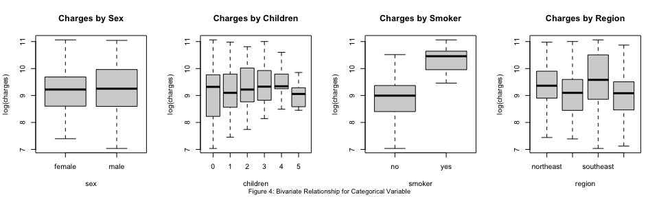
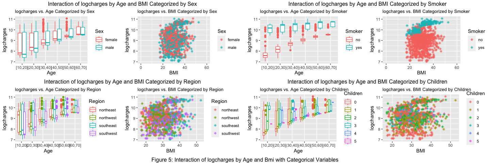
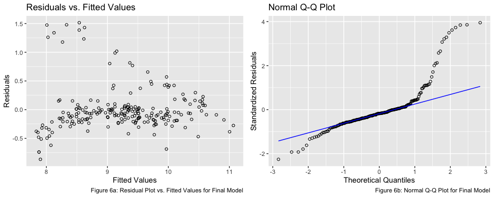
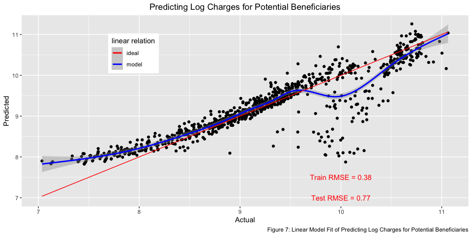

# 1 | Introduction

Since healthcare in one of the principle issues to be targeted in the
United States, it is no surpise that medical insurance is the center of
attention. Medical insurance firms study the risk depedning on the
attributions of their beneficiaries, or customers in order to predict
charges for new beneficiaries. In this report, we will examine the
efficiency of charges of new beneficiaries for a medical insurance firm
using a **linear regression model** in order to best predict the
upcoming charges paid by the particular insurance company for new
beneficiaries given certain attributes. In addition, we will also
evaluate the how the model may be utilized to reduce cost associated
with the firm’s *wellness incentives program*, a program aimed to adopt
more health behaviors and lifestyle by preventing bad health and
illnesses.

# 2 | Data Description

The dataset contains the information and charges paid by a particular
medical insurance company over a fixed time for 1,110 primary
beneficiaries (i.e. customer) who purchased an insurance policy with
corresponding conditions, which includes potentially covering medical
expenses for their children.

Each primary beneficiary contains the following 7
variables:

| Variable     | Description                                                                                             | Type        |
| ------------ | ------------------------------------------------------------------------------------------------------- | ----------- |
| **age**      | age of beneficiary (in years)                                                                           | Continuous  |
| **sex**      | sex of beneficiary (male or female)                                                                     | Categorical |
| **bmi**      | body mass index (body mass in kilograms divided by the square of body height in meters)                 | Continuous  |
| **children** | number of children also covered by the beneficiary’s insurance policy                                   | Continuous  |
| **smoker**   | indicates whether or not the beneficiary is a regular smoker                                            | Ordinal     |
| **region**   | region of the United States in which the beneficiary lives (Northeast, Southeast, Southwest, Northwest) | Categorical |
| **charges**  | medical costs billed to the insurance company (in dollars)                                              | Continuous  |

In this analysis, we focus on predicting the charges for a new
beneficiary; `charges` is set as a response variable while the remaining
six are set as explanatory variables (also known as predictor
variables). In other words we will aim to predict the amount of charges
covered for that customer within the fixed time frame given a particular
attribute of customer. Afterwards, we will aim to interpret the cost
reduction associated with changes of explanatory variables that might
potentially affect the health of beneficiaries.

# 3 | Explanatory Data Analysis

Before diving into linear modelling or regressions, we will look more
closely into the dataset to get a better understanding on the
relationships of variables by visualizing the distribution.

## 3.1 | Univariate Relationship

To start our analysis, we need to briefly explore and understand the
given dataset before modeling. The Figure 1a is the distribution of our
response variable, `charges` through a histogram. It can be clearly
observed that the dataset is skewed-right. Most of the beneficiaries had
the insurance company pay below 15,000 dollars within the fixed time
frame with the mean at around 10,000 dollars.

<!-- -->

Since linear models are assumed to be normally distributed, we will
perform a *log* transformation on the variable `charges` to `logcharges`
in order to transform the highly skewed variable into a rather normally
ditribubted variable as shown in Figure 1b. Note that when we take in
effect of the *log* transformation, it will remove the data points of
`charges` with a zero (or below) value as it will create `NaN`s for two
beneficiaries. Upon a closer look, the data points that generated `NaN`s
are most likely to be an error rather than an actual observation because
there cannot exist a negative charge (insurance company paying back
beneficiaries).

<!-- -->

In addition, in Figure 2, we observe that there exist an extreme outlier
(indicated in red) in the univariate distribution of `bmi`. Since the
value of BMI cannot be as large as that of the outlier (since BMI is
generally between 18.5 to 30), it is safe to assume that this outlier is
also an error rather than an legitimate observation; as such going
forward this point will be removed from the dataset.

## 3.2 | Bivariate Relationship

#### 3.2.a | Bivariate Relationship of Numerical Explanatory Variables

As mentioned in the previous section, *Section 2: Data Description*, the
numerical explanatory variables include both continuous and ordinal
type, thus the following: `age`, `bmi`, and
`logcharges`.

Firstly, from Figure 3, it can be seen that there is no negative
correlation within the the variables, since they are all positive
values.

Secondly, though only a moderate correlation, `age` demonstrates the
strongest correlation with `logcharges` of 0.47; meanwhile, there does
not seem to be a significant correlation with `bmi`.

Additionally, the explanatory variables are not closely correlated with
one another, thus there is no collinearity existent. Instead, it appears
that `bmi` and `age` has the weakest correlation of 0.13. This mean that
the age of the beneficiary barely affects the bmi of beneficiary and
vice versa, which is a logical statement since `bmi` is more related to
how healthy the beneficiary is regardless of `age`.

#### 3.2.b | Bivariate Relationship of Categorical Explanatory Variables

<!-- -->

From Figure 4, `logcharges` on average are similar regardless of `sex`,
though the charges of males seem to be at a slightly wider variety.
Whether the beneficiary is a `smoker` seem to affect the `logcharges` of
health insurance companies the most, with the highest correlation with
`logcharges`. This makes sense intuitively because smokers are more
likely to be exposed to health issues. The variable `region` also is
moderately correlated with `logcharges`. Those beneficiaries residing in
the east coast seem to charge more than those residing in the west
coast. Beneficiaries from southeastern region seem to charge the
insurance company the most. This could be for a number of factors:
weather, lifestyle, culture, etc. One asssumption could be that the
southeastern region has the most states that has not yet enforced
smoking bans in workplaces, restaurants, and bars.

It seems that the beneficiaries with no children covered by the
beneficiary’s insurance policy have the highest average value of
`logcharges`. This value drops with a presence of one child. The average
of `logcharges` continues to increase from `children` value 1 to 4.
However, there seems to be generally less variation in charges with
insurance policy that cover higher number of `children`. One assumption
could be because the higher number of `children` the beneficiary inclues
in the insurance policy, the more occations the beneficiary has to
charge the insurance company, but with less variety of reasons; comon
reasons include flu, toothaches, etc. There seems to be multiple factors
that could affect `logcharges` Figure 4.

## 3.3 | Interactions

Apart from the indicator whether a beneficiary is a smoker or not:
`smoker`, which has a strong correlation with the `logcharges` medical
insurance companies cover for the beneficiary within the given time
frame, the rest of the explanatory variables with correlations
(`region`, `age`, `children`, and `bmi`) indicates that there is neither
a strong nor weak correlation with the response variable. In order to
explore more deeply into the relationship of the explanatory variables
to the response variable, we will examine if there exists any
significant interaction between the continuous variables(`age` and
`bmi`) and categorical variables (`sex`, `smoker`,`region`, and
`children`).

<!-- -->

Figure 5 generally displays that there is no significant relationship
shown through interaction except for interaction with `smoker`. The
relationship between both `age` and `bmi` with `logcharges` seem to
depend on `smoker` of the beneficiary. In the graphs above, we can see
that there is almost a parallel relationship between the smokers and
non-smokers and age of beneficiaries to the `logcharges`. There is
around a $20,000 jump between those who smoke and do not smoke and
despite whether the beneficiaries are smokers or not, the beneficiaries
seem to visit the hospital more often (charge the insurance company
more) if they are older, which makes sense.

In addition, there is a somewhat recognizable pattern with the
non-smokers while a jump could be seen on the `logharges` with
`smokers`. This implies that in general, non-smokers with higher `bmi`
would be exposed to higher diseases such as heart disease, high blood
pressure, diabetes etc. than non-smokers with lower `bmi` (the most
healthy group of people\!), but it is nowhere close to a `smoker`. A
`smoker` status with a `bmi` higher than 25 are to exponentially
increase health dangers as it is a fatal combination that determines
health (imagine a person with bad health habits AND smokes). It can be
observed that the indication whether a `smoker` has more affect on
`logcharges` when interacted with `bmi` of the beneficiary than the
`age` of the beneficiary.

From these observations, there are likely to be two interaction terms in
ourlinear regression model to predict `logcharges` of future potential
beneficiaries: 1) `age` and `smoker` and 2) `bmi`and `smoker`.

# 4 | Modeling, Prediction, Inference

Proceeding from our exploratory data analysis, we will fit a linear
model to best predict `logcharges` of future potential benficiaries
based on other attributes in the dataset; to find the best fit
coefficients that best predict the change in `logcharges` given a unit
change in the explanatory variable.

Here, we define the *null model* to be a intercept-only model that
describes the response variable, `logcharges`. We also define the *full
model* as follows, which includes all predictor variables still under
consideration, in addition to interaction terms. The simple linear
regression model follows the function in which *y* is the response
variable `logcharges`, *X* is the design matrix of explanaotry
variables, and ε is the error vector.

*y = β₀ + Xᵢβᵢ + ε*

Our goal for this analysis is to best predict our response variable
`logcharges` simulatenously means to find the model that “best fit” the
dataset; following the ordinary least squares equation. This implies
that the coefficients that best fit the dataset is to minimize of the
error sums of squares.

In order to build a linear regression model, firstly, the initial model
(inclusion of each explanatory variable with no interactions) is set as
below:

As the goal for the analysis is to *predict* the `logcharges` of new
beneficiaries, a 80-20 split for a train-test will be performed. 885
observations will be used to construct the model of best fit while the
remaining 222 observations will be used to assess the prediction
performance of the constructed model.

The initial model has a multiple R2 value of 0.7 and an
adjusted R2 value of 0.7266, indicating fairly satisfactory
initial model. The p-values are low with most of the coefficients being
statistically significant with the corresponding p-value of below the 5%
level (See *Appendix* for R output). However, the best model is not
always the most complicated, thus the full model is not necessary in
building the model because too many variables can bring up issue of
collinearity; estimate might not be biased, but variance is affected.

Before looking into interactions, the explanatory variables will be
observed. Since the statistical significance of the explanatory
variables `sex` and `children` were not definite from *Section 3.2.b |
Bivariate Relationship of Categorical Explanatory Variables*, an
incremental one-sided F-test will be proceeded by using the `anova`
function to compare competing models with and without the presence of
the repsective coefficients and the “null model” in order recognize
areas of improvement from the initial model; the null model is when the
respective coefficients are values of
0.

| Model                     | Forumla                                                   | Residual Degrees of Freedom | Residual Sums of Squares | Degrees of Freedom | Sum of Squares | F      | Pr(\>F)       |
| ------------------------- | --------------------------------------------------------- | --------------------------- | ------------------------ | ------------------ | -------------- | ------ | ------------- |
| Null Model                | logcharges ~ age + bmi + smoker + region                  | 214                         | 45.141                   |                    |                |        |               |
| Model with Children       | logcharges ~ age + bmi + smoker + region + children       | 209                         | 41.530                   | 5                  | 3.6111         | 3.6877 | 0.003218 \*\* |
| Model with Children + Sex | logcharges ~ age + bmi + smoker + region + children + sex | 208                         | 40.736                   | 1                  | 0.7935         | 4.0518 | 0.045412 \*   |

From the Table above, though both models have a significant p-value
below 0.05, the **Model with Children + Sex** barely passes with a value
of 0.045; the explanatory variable `sex` will be excluded from the final
model, while including `children`.

Considering the interactions examined in *Section 3.3: Interactions*,
the interactions of `smoker` and variables `age` and `bmi` will be
considered. Similarly, the results of the incremental F-tests is
computed
below:

| Model                              | Forumla                                                                       | Residual Degrees of Freedom | Residual Sums of Squares | Degrees of Freedom | Sum of Squares | F      | Pr(\>F)          |
| ---------------------------------- | ----------------------------------------------------------------------------- | --------------------------- | ------------------------ | ------------------ | -------------- | ------ | ---------------- |
| Model                              | logcharges ~ age + bmi + smoker + region + children                           | 209                         | 41.530                   |                    |                |        |                  |
| Model with Age:Smoker              | logcharges ~ age + bmi + smoker + region + children + age:smoker              | 208                         | 34.724                   | 1                  | 6.8060         | 43.533 | 3.424e-10 \*\*\* |
| Model with Age:Smoker + BMI:Smoker | logcharges ~ age + bmi + smoker + region + children + age:smoker + bmi:smoker | 207                         | 32.363                   | 1                  | 2.3612         | 15.103 | 0.000137 \*\*\*  |

Both interactions are significant as the p-values are safely below 0.05,
thus both interactions will be included in the model. Thus, the final
linear regression model for this analysis has been completed with the
following coefficients:
`age`,`bmi`,`smoker`,`region`,`children`,`age:smoker`, and `bmi:smoker`.

# 5 | Model Diagnostics

Our final model, with 14 regressor terms including the intercept, is as
below:

The model has a Multiple R2 value of 0.7946, an Adjusted
R2 value of 0.7817 and a low p-value, which is fairly
satisfactory (See *Appendix* for R output). However, this model still
raise areas of concerns. First and foremost, as we assumed `children` to
be a categorical variable rather than a continous variable (as it was an
ordinal type), inidicating an overfitting of the data. Additionally, the
`smoker`, `children5`, and potentially `children4` coefficients have a
fairly large standard error values of around 0.36, 0.29, and 0.17
respectively, indicating wide range of uncertainity on the prediction.
Finally, with the addition of interactions, some coefficients such as
`bmi`, `children3`, and `children5` are no longer below the p value of
0.05, thus not statistically significant.

<!-- -->

The final model derived implies a biased prediction for some data points
and does not follow the linear regression normality assumptions for
serveral reasons. Based on Figure 6, there is no linearity for our
response variable as shown as the residual errors does not portray
homoscedasticity. The response variable `logcharges` does not follow the
linear regression normality assumptions because as illustrated in Figure
1b, the dataset only has a **roughly** normal distribution from our
initial log tranformation. Another reason of non-normality is from the
long right-tail displayed from the Normal Q-Q Plot of Figure 6b.
Nevertheless, the model will proceed to be used for interpretation and
prediction.

# 6 | Model Interpretation

In order to proceed to prediction of our final linear regression model,
there are a few keypoints to be mentioned. The model has an Adjusted
R2 value of 0.7397, which indicates a good fit, capturing
around 80% of the variance in `logcharges`. Let ŷ be the predicted
`logcharges` of a beneficiary. In regards to the regressor coefficients,
the coefficients of the final model is the partial relationship between
y and its respective x after all the explanatory variables are
“proejected out”. For instance, one unit increase in `age` will lead
to a change by 0.037416 in ŷ, holding all other coefficients constant.
An one unit increase in `bmi` will lead to an average increase of ŷ by
0.003282, holding all other coefficients constant.

In regards to the categorial variables, `children`, `smoker`, and
`region` have been separated into unique dummy variable columns (also
known as an indicator variable); all the categorical variables are
binary for this analysis. The variables `smoker` (yes/no) is encoded as
a single dummy variable column; a beneficiary who is a smoker would hold
an increase of average log ŷ value of 1.315989 more than a beneficiary
who does not smoke, holding all other coefficients constant. In
addition, `children` and `region` have more than 2 “options”. In this
case, the model will drop one ‘value’ and define k-1 dummy variables;
the model drops “regionnortheast” and “children0”. The dummy variables
of the categorical variable will be defined as 0’s and 1’s (0 represents
absence of the qualitative attribute and 1 represents the presence of
the qualitative attribute). A beneficiary who has 1,2,3,4,5 children
will increase of log ŷ value by an average of 0.174946, 0.198201,
0.148452, 0.732462, and 0.293686 repsectively. Similarly, if a
beneficiary lives in the northwest, southeast, and southwest region of
the United States, the log ŷ value will decrease by an average of
0.219354, 0.207655, and 0.267488 respectively. However, it is difficult
to interpret the relative importance of categorical variables since
there is one categorical group in the intercept and we cannot interpret
the intercept term. It is worth mentioning that the intercept is not
scientifically interesting because no beneficiaries have age 0.

In regards to the interaction terms, `age:smoker` indicates that the
linear relationship of `age` and `logcharges` or “slope of the
coefficient” can vary depending on the `smoker` status of the
beneficiary. Similarly, `bmi:smoker` indicates that the linear
relationship of `bmi` and `logcharges` or “slope of the coefficient” can
vary depending on the `smoker` status of the beneficiary. One intersting
result from the model is that `age:smokeryes` has a negative
coefficient, meaning that an older beneficiary who smokes supposedly has
lower medical charges, which sounds counterintuitive. When interpreted
with `age`,-0.031184 + 0.037416 = 0.006232, it will generate a positive
coefficient. Again, as the interactions are of numerical and categorical
variable, since we cannot standardize coefficients to compare the
relative importance of variables, it will be difficult to interpret the
interaction variables as well.

# 7 | Prediction

As the main goal of the analysis was to predict the `logcharges`through
the model genereated from the train set, we will test the predictions
onto the 222 observations set aside in order to test our model’s
performance on predicting charges of new potential beneficiaries.

<!-- -->

Figure 7 is a relative fit of our final model, visualizing the root mean
square error (MSE) of the training and testing set; as shown above, the
actual model (in blue) with 95% confidence interval (shaded along the
blue line) does not fit with the ideal model (in red). In addition, the
Root Mean Squared Error (RMSE) of the training and testing set is around
0.38 and 0.77 respectively, displaying a poor performance of prediction
as the values are far apart from each other.

# 8 | Casual Inference | Wellness Plan

As the analysis is to predict `logcharges`, we will limit ourselves to
make association assumption from our model. Even though casual
relationship may not hold, even when other regressors are held constant,
it can still be important to note that `smoker` status can increase
medical insurance charges. Although there might be other variables that
needs to be taken into consideration or a different model for this
dataset, it is intuitive that smoking can cause a higher chance of
health problems. Alternatively, `smoker` is not a *direct* cause of
health issue (and cause medical charges to increase), but can be an
indirect cause that could trigger the possibility of cardiovascular or
respiratory diseases.

The particular insurance company is considering to start a wellness
incentives program that encourages beneficiares to adapt more healthy
behaviors. the goal is to reduce charges by preventing health and
illness. This plan would intuitively control the `bmi` and `smoker`
regressors as other regressors cannot be altered as directly. However,
the model generated from this analysis is not an accurate model to
assess the wellness incentives program for several reasons.

As `smoker` status affects the charges of beneficiaries the most
according to the model, in order to reduce medical charges, it would be
the most sensible choice to stop smoking for the beneficiaries who
smoke. However, this would only work to a certain extent and is not the
ultimate solution as it depends on other factors of the beneficiary: how
heavy of a smoker they were, how long they have been smoking for, if
they are still exposed to second-hand smoking etc.

Moreover, as `bmi` decreases, it can be initially predicted that the
charges of the medical insurance would decrease as well as from the
interaction regressor `bmi:smokeryes` indicates a positive coefficient.
As mentioned in *Section 6: Model Interpretation*, as the `bmi:smokerno`
is included in the intercept term, which cannot be closely evaluated or
interpreted, it would be impossible to predict the effect of `bmi` even
when a beneficiary stops smoking from this model. Even though we are not
sure of the effects a beneficiary when he stops smoking, but we will be
able to predict that the beneficiary will be able to lower insurance
charges if the particular beneficiary continues smoking, but adapt a
healther lifestyle and lose weight (lower `bmi` levels).

Aside these reasons, since we have resulted that our linear model had a
poor performance, the cost reduction prediction from altering behaviors
of beneficiaries according to our model is not reliable.

# 9 | Conclusion

In this analysis, we have analyzed the dataset on charges of medical
insurance on beneficiaries and were to predict charges of potential
future beneficiaries given certain attributes and information. Although
the final linear regression model derived from the report initially
seemed perform accurately in predicting potential charges when tested on
the testing data, it raised some concerns and limitations on the key
aspect of normality assumption of linear regression method as well as
underlying confounding factors that were not considered in the dataset.
For these reasons, a linear regression model is not the best approach in
modeling the data to predict charges of future beneficiaries.
